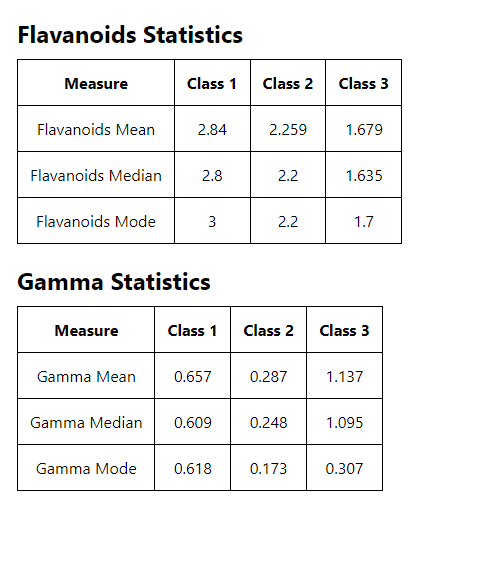

# Wine Statistics Project
This project is a statistical analysis tool for wine data, aimed at calculating various statistics such as mean, median, and mode for specific attributes in the dataset.

## Setup

### Prerequisites

- Node.js (at least v12.0.0)
- yarn

use 

### Installation

1. Clone this repository to your local machine using `git clone https://github.com/shubhsharma23/Wine-statistics.git`.
2. Navigate to the project directory: `cd wine-statistics-project`.
3. Install dependencies: `yarn install`

## Usage

### Starting the Application

To start the application, run the following command:
`yarn start`

